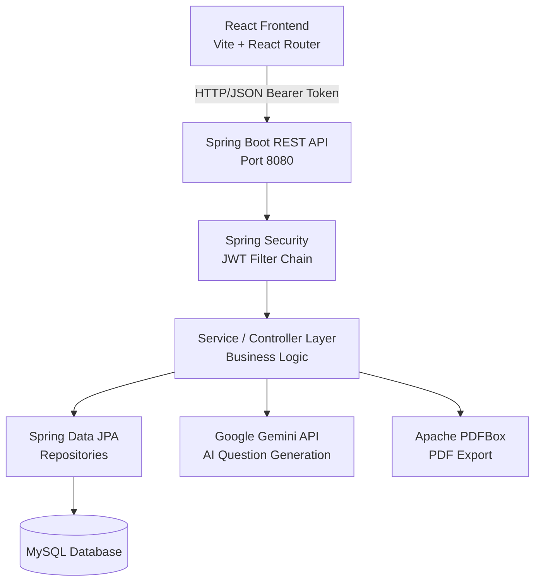

# Design Document: Online Quiz and Examination Management System

## Overview

A full-stack web application with a Spring Boot 3.5 REST API backend and a React (Vite) frontend. Three roles — Administrator, Professor, Student — interact through role-specific browser-based dashboards. The backend uses Spring Security with stateless JWT authentication, Spring Data JPA over MySQL, and Apache PDFBox for PDF export. An AI question generation feature calls the Google Gemini API to produce MCQs from uploaded PDF/DOCX documents. The frontend communicates with the backend exclusively via HTTP/JSON.

---

## Architecture



---

## Backend Package Structure

```
com.quizexam
├── Main.java                          # SpringApplication entry point
├── config/
│   └── SecurityConfig.java            # Spring Security filter chain, CORS, BCrypt bean
├── security/
│   ├── JwtUtils.java                  # Token generation, validation, username extraction
│   ├── JwtAuthFilter.java             # OncePerRequestFilter — reads Bearer token
│   └── UserDetailsServiceImpl.java    # Loads UserDetails from UserRepository
├── exception/
│   ├── AppException.java              # Base runtime exception
│   ├── AuthException.java
│   ├── DuplicateUserException.java
│   ├── UnauthorizedException.java
│   ├── ValidationException.java
│   ├── QuestionInUseException.java
│   ├── ExamHasAttemptsException.java
│   ├── AlreadyAttemptedException.java
│   ├── ExamNotAvailableException.java
│   └── DatabaseException.java
├── model/
│   ├── User.java                      # @Entity
│   ├── Role.java                      # Enum: ADMIN, PROFESSOR, STUDENT
│   ├── Question.java                  # @Entity @Inheritance(SINGLE_TABLE)
│   ├── MCQ.java                       # @Entity subclass
│   ├── AssertionReasonQuestion.java   # @Entity subclass
│   ├── TrueFalseQuestion.java         # @Entity subclass
│   ├── ARChoice.java                  # Enum: 5 choices
│   ├── Difficulty.java                # Enum: EASY, MEDIUM, HARD
│   ├── Exam.java                      # @Entity
│   ├── Attempt.java                   # @Entity
│   ├── AttemptAnswer.java             # @Entity
│   ├── Result.java                    # @Entity
│   ├── Notification.java              # @Entity
│   ├── ExamStats.java                 # DTO (not persisted)
│   └── QuestionStats.java             # DTO (not persisted)
├── repository/
│   ├── UserRepository.java            # JpaRepository<User, Long>
│   ├── QuestionRepository.java        # JpaRepository<Question, Long>
│   ├── ExamRepository.java            # JpaRepository<Exam, Long>
│   ├── AttemptRepository.java         # JpaRepository<Attempt, Long>
│   ├── AttemptAnswerRepository.java   # JpaRepository<AttemptAnswer, Long>
│   ├── ResultRepository.java          # JpaRepository<Result, Long>
│   └── NotificationRepository.java    # JpaRepository<Notification, Long>
├── controller/
│   ├── AuthController.java            # POST /api/auth/login, /api/auth/register
│   ├── UserController.java            # GET/PUT /api/users/me, admin CRUD
│   ├── QuestionController.java        # CRUD + AI generation endpoints
│   ├── ExamController.java            # CRUD + publish
│   ├── AttemptController.java         # start, submit, tab-switch, my-attempts
│   ├── ResultController.java          # results, CSV/PDF export
│   ├── AnalyticsController.java       # stats, hardest questions, score distribution
│   ├── NotificationController.java    # list, mark-read, fan-out triggers
│   ├── AdaptiveExamController.java    # next-question for adaptive exams
│   └── GlobalExceptionHandler.java    # @RestControllerAdvice — maps exceptions to HTTP
└── service/
    ├── AiQuestionGeneratorService.java  # Calls Gemini API, parses JSON response
    └── DocumentTextExtractor.java       # Extracts text from PDF/DOCX via PDFBox + POI
```

---

## Frontend Structure

```
quiz-exam-frontend/src
├── api/
│   └── api.js                  # Central fetch client; attaches Bearer token from localStorage
├── context/
│   └── AuthContext.jsx          # Session state (token, userId, username, role)
├── components/
│   ├── Navbar.jsx
│   └── Badge.jsx
└── pages/
    ├── LandingPage.jsx
    ├── LoginPage.jsx
    ├── RegisterPage.jsx
    ├── ProfilePage.jsx
    ├── admin/
    │   ├── AdminDashboard.jsx
    │   ├── AdminUsers.jsx
    │   ├── AdminAnalytics.jsx
    │   └── AdminResults.jsx
    ├── professor/
    │   ├── ProfessorDashboard.jsx
    │   ├── ProfessorQuestions.jsx
    │   ├── ProfessorExams.jsx
    │   ├── ProfessorResults.jsx
    │   └── GenerateQuestions.jsx
    └── student/
        ├── StudentDashboard.jsx
        ├── StudentExams.jsx
        ├── StudentResults.jsx
        └── ExamAttempt.jsx
```

---

## Components and Interfaces

### REST API Endpoints

#### Authentication — `/api/auth`
| Method | Path | Auth | Description |
|---|---|---|---|
| POST | `/api/auth/login` | Public | Returns JWT token + user info |
| POST | `/api/auth/register` | Public | Creates STUDENT or PROFESSOR account |

#### Users — `/api/users`
| Method | Path | Auth | Description |
|---|---|---|---|
| GET | `/api/users/me` | Any | Get own profile |
| PUT | `/api/users/me` | Any | Update email/password |
| GET | `/api/users` | ADMIN | List all users |
| DELETE | `/api/users/{id}` | ADMIN | Delete user |
| POST | `/api/users/admin` | ADMIN | Create admin account |

#### Questions — `/api/questions`
| Method | Path | Auth | Description |
|---|---|---|---|
| GET | `/api/questions` | Any | List/filter questions |
| GET | `/api/questions/{id}` | Any | Get question by ID |
| POST | `/api/questions/mcq` | PROF/ADMIN | Create MCQ |
| POST | `/api/questions/tf` | PROF/ADMIN | Create True/False |
| POST | `/api/questions/ar` | PROF/ADMIN | Create Assertion-Reason |
| DELETE | `/api/questions/{id}` | PROF/ADMIN | Delete question |
| POST | `/api/questions/generate` | PROF/ADMIN | AI generation from PDF/DOCX |
| POST | `/api/questions/save-generated` | PROF/ADMIN | Persist AI-generated MCQs |

#### Exams — `/api/exams`
| Method | Path | Auth | Description |
|---|---|---|---|
| GET | `/api/exams` | Any | List all exams |
| GET | `/api/exams/active` | Any | List active exams |
| GET | `/api/exams/{id}` | Any | Get exam by ID |
| POST | `/api/exams` | PROF/ADMIN | Create exam |
| PUT | `/api/exams/{id}` | PROF/ADMIN | Update exam |
| PUT | `/api/exams/{id}/publish` | PROF/ADMIN | Publish exam (set ACTIVE) |
| DELETE | `/api/exams/{id}` | PROF/ADMIN | Delete exam |

#### Attempts — `/api/attempts`
| Method | Path | Auth | Description |
|---|---|---|---|
| POST | `/api/attempts/start/{examId}` | STUDENT | Start or resume attempt |
| POST | `/api/attempts/{id}/submit` | STUDENT | Submit answers, get result |
| POST | `/api/attempts/{id}/tab-switch` | STUDENT | Log tab switch event |
| GET | `/api/attempts/my` | STUDENT | Get own attempts |

#### Results — `/api/results`
| Method | Path | Auth | Description |
|---|---|---|---|
| GET | `/api/results/my` | STUDENT | Get own results |
| GET | `/api/results/exam/{examId}` | PROF/ADMIN | Results for an exam |
| GET | `/api/results` | ADMIN | All results |
| GET | `/api/results/{id}` | Any | Get result by ID |
| GET | `/api/results/exam/{examId}/export/csv` | PROF/ADMIN | Export CSV |
| GET | `/api/results/exam/{examId}/export/pdf` | PROF/ADMIN | Export PDF |

#### Analytics — `/api/analytics`
| Method | Path | Auth | Description |
|---|---|---|---|
| GET | `/api/analytics/exam/{examId}/stats` | PROF/ADMIN | Avg/median/high/low/pass% |
| GET | `/api/analytics/exam/{examId}/hardest-questions` | PROF/ADMIN | Questions by incorrect rate |
| GET | `/api/analytics/student/{studentId}/progress` | PROF/ADMIN | Per-exam scores for student |
| GET | `/api/analytics/exam/{examId}/score-distribution` | PROF/ADMIN | Score bucket counts |

#### Notifications — `/api/notifications`
| Method | Path | Auth | Description |
|---|---|---|---|
| GET | `/api/notifications` | Any | Get own notifications |
| GET | `/api/notifications/unread-count` | Any | Unread count |
| PUT | `/api/notifications/{id}/read` | Any | Mark one as read |
| PUT | `/api/notifications/read-all` | Any | Mark all as read |
| POST | `/api/notifications/exam-available/{examId}` | PROF/ADMIN | Fan-out to all students |
| POST | `/api/notifications/results-published/{examId}` | PROF/ADMIN | Fan-out to all students |

#### Adaptive Exam — `/api/adaptive`
| Method | Path | Auth | Description |
|---|---|---|---|
| GET | `/api/adaptive/{attemptId}/next` | STUDENT | Get next question based on performance |

### Security Architecture

```
Request
  └─► JwtAuthFilter (OncePerRequestFilter)
        ├─ Extract "Authorization: Bearer <token>" header
        ├─ JwtUtils.validateToken(token)
        ├─ JwtUtils.getUsernameFromToken(token)
        ├─ UserDetailsServiceImpl.loadUserByUsername(username)
        └─ Set SecurityContextHolder authentication

SecurityConfig
  ├─ CSRF disabled (stateless JWT)
  ├─ Session policy: STATELESS
  ├─ Public: POST /api/auth/login, POST /api/auth/register
  ├─ ADMIN only: /api/admin/**
  ├─ PROFESSOR or ADMIN: POST/PUT/DELETE /api/questions/**, /api/exams/**
  └─ All other requests: authenticated
```

### JWT Token Structure
- Algorithm: HMAC-SHA256
- Claims: `sub` (username), `iat`, `exp`
- Expiry: 24 hours (configurable via `app.jwt.expiration-ms`)
- Storage: client-side `localStorage` key `qm_session`

### AI Question Generation Flow
```
POST /api/questions/generate (multipart: file, count)
  └─► DocumentTextExtractor.extract(file)
        ├─ PDF → PDFBox PDFTextStripper
        └─ DOCX → Apache POI XWPFDocument
  └─► AiQuestionGeneratorService.generate(text, count)
        ├─ Build prompt with document text
        ├─ POST to Gemini 1.5 Flash API
        └─ Parse JSON array of GeneratedQuestion DTOs
  └─► Return preview list (not yet saved)

POST /api/questions/save-generated (body: sourceDocument, questions[])
  └─► Persist approved MCQs to question bank
```

---

## Data Models

### Entity: User
| Column | Type | Notes |
|---|---|---|
| id | BIGINT PK | auto-increment |
| username | VARCHAR(50) UNIQUE | |
| email | VARCHAR(100) UNIQUE | |
| password_hash | VARCHAR(255) | BCrypt cost 12 |
| role | ENUM('ADMIN','PROFESSOR','STUDENT') | |
| created_at | TIMESTAMP | |

### Entity: Question (single-table inheritance)
| Column | Type | Notes |
|---|---|---|
| id | BIGINT PK | |
| type | ENUM('MCQ','AR','TF') | discriminator |
| text | TEXT | |
| difficulty | ENUM('EASY','MEDIUM','HARD') | nullable |
| subject | VARCHAR(100) | nullable |
| topic | VARCHAR(100) | nullable |
| created_by | BIGINT FK → User | |
| source_document | VARCHAR(255) | nullable; set for AI-generated questions |

### Entity: MCQ (extends Question)
| Column | Type | Notes |
|---|---|---|
| option_texts | JSON / @ElementCollection | 4 options |
| correct_index | INT | 0–3 |

### Entity: AssertionReasonQuestion (extends Question)
| Column | Type | Notes |
|---|---|---|
| assertion | TEXT | |
| reason | TEXT | |
| correct_choice | INT | 1–5 |

### Entity: TrueFalseQuestion (extends Question)
| Column | Type | Notes |
|---|---|---|
| correct_answer | BOOLEAN | |

### Entity: Exam
| Column | Type | Notes |
|---|---|---|
| id | BIGINT PK | |
| title | VARCHAR(200) | |
| description | TEXT | nullable |
| time_limit_minutes | INT | ≥ 1 |
| marks_per_question | INT | |
| negative_marking | DECIMAL(5,2) | 0 if not used |
| is_adaptive | BOOLEAN | |
| status | ENUM('DRAFT','ACTIVE') | |
| start_datetime | DATETIME | nullable |
| end_datetime | DATETIME | nullable |
| created_by | BIGINT FK → User | |

### Entity: Attempt
| Column | Type | Notes |
|---|---|---|
| id | BIGINT PK | |
| exam_id | BIGINT FK → Exam | |
| student_id | BIGINT FK → User | |
| started_at | TIMESTAMP | |
| submitted_at | TIMESTAMP | nullable |
| status | ENUM('IN_PROGRESS','SUBMITTED') | |
| tab_switch_count | INT | default 0 |
| UNIQUE(exam_id, student_id) | | prevents re-attempt |

### Entity: AttemptAnswer
| Column | Type | Notes |
|---|---|---|
| id | BIGINT PK | auto-increment |
| attempt_id | BIGINT FK → Attempt | |
| question_id | BIGINT FK → Question | |
| selected_answer | VARCHAR(255) | null if unanswered |
| is_correct | BOOLEAN | set on submit |

### Entity: Result
| Column | Type | Notes |
|---|---|---|
| id | BIGINT PK | |
| attempt_id | BIGINT UNIQUE FK → Attempt | |
| total_score | DECIMAL(8,2) | supports negative values |
| max_score | INT | |
| percentage | DECIMAL(5,2) | |
| detail_json | TEXT | per-question breakdown |

### Entity: Notification
| Column | Type | Notes |
|---|---|---|
| id | BIGINT PK | |
| user_id | BIGINT FK → User | |
| message | TEXT | |
| exam_id | BIGINT FK → Exam | nullable |
| created_at | TIMESTAMP | |
| is_read | BOOLEAN | default false |

### DTO: ExamStats (not persisted)
| Field | Type |
|---|---|
| examId | long |
| averageScore | double |
| medianScore | double |
| highestScore | double |
| lowestScore | double |
| passPercentage | double |
| totalAttempts | int |

---

## Key Backend Flows

### Registration & Login
```
POST /api/auth/register { username, email, password, role }
  → validate fields (non-empty, email format, password length ≥ 8)
  → reject role=ADMIN (self-registration blocked)
  → check username/email uniqueness via UserRepository
  → BCryptPasswordEncoder.encode(password) with cost 12
  → userRepository.save(user)
  → return { message: "Registration successful" }

POST /api/auth/login { username, password }
  → AuthenticationManager.authenticate(UsernamePasswordAuthenticationToken)
  → Spring Security verifies BCrypt hash via UserDetailsServiceImpl
  → JwtUtils.generateToken(username) → HMAC-SHA256 JWT
  → return { token, userId, username, role, email }
```

### Exam Attempt Lifecycle
```
POST /api/attempts/start/{examId}
  → check exam.status == ACTIVE
  → check no existing SUBMITTED attempt for (student, exam)
  → if IN_PROGRESS attempt exists: return it (resume)
  → create Attempt(status=IN_PROGRESS, startedAt=now())
  → return Attempt

POST /api/attempts/{attemptId}/submit { answers: { "questionId": "selectedAnswer", ... } }
  → verify attempt belongs to authenticated student
  → set attempt.status = SUBMITTED, submittedAt = now()
  → for each question in exam: compare answer to correctAnswerValue
  → compute correct count, total_score, max_score, percentage
  → save AttemptAnswer records (attemptId, questionId, selectedAnswer, isCorrect)
  → save Result
  → return { score, total, totalScore, maxScore, percentage, passed }
```

### Scoring Algorithm
```
for each question in exam.questions:
  given = answers.get(questionId)   // null if unanswered
  isCorrect = given != null && given.equals(question.correctAnswerValue)
  if isCorrect: correct++

totalScore = correct × exam.marksPerQuestion
maxScore   = questions.size() × exam.marksPerQuestion
percentage = questions.isEmpty() ? 0 : (correct × 100.0 / questions.size())
```

Note: The current implementation does not apply negative marking deduction at submit time (`negativeMarking` is stored on Exam but scoring uses correct count only). The scoring formula computes percentage as `correct / total * 100`, not `totalScore / maxScore * 100`.

### Adaptive Question Selection
```
GET /api/adaptive/{attemptId}/next
  → load attempt, verify ownership and IN_PROGRESS status
  → load exam, verify is_adaptive = true
  → load all answered question IDs from AttemptAnswer
  → if all questions answered: return { done: true }
  → determine targetDifficulty from last answer:
      last correct  → stepUp(lastQuestion.difficulty)
      last incorrect → stepDown(lastQuestion.difficulty)
      no answers yet → MEDIUM
  → filter unanswered questions at targetDifficulty
  → fallback: any unanswered question if no difficulty match
  → return { done: false, question, questionNumber, totalQuestions }
```

---

## Correctness Properties

*A property is a characteristic or behavior that should hold true across all valid executions of a system — essentially, a formal statement about what the system should do. Properties serve as the bridge between human-readable specifications and machine-verifiable correctness guarantees.*

### Property 1: Password hashing non-reversible and verifiable
*For any* plaintext password, the stored BCrypt hash must not equal the plaintext AND `BCryptPasswordEncoder.matches(plaintext, hash)` must return `true`.
**Validates: Requirements 1.3**

### Property 2: Login rejects wrong credentials
*For any* registered user, supplying an incorrect password must result in an authentication failure and must not return a JWT token.
**Validates: Requirements 1.5**

### Property 3: Admin creation requires admin caller
*For any* request to `POST /api/users/admin`, the request must be rejected with 403 unless the caller has the ADMIN role.
**Validates: Requirements 1.7**

### Property 4: MCQ correct-option invariant
*For any* MCQ stored in the database, exactly one of its four options must be designated as correct (`correctIndex` in [0, 3] and options list has exactly 4 entries).
**Validates: Requirements 2.1**

### Property 5: Assertion-Reason choice range invariant
*For any* AR question stored in the database, `correct_choice` must be in [1, 5].
**Validates: Requirements 2.2**

### Property 6: Question search filter correctness
*For any* combination of filter parameters (subject, difficulty), all questions returned by `GET /api/questions` must satisfy every non-null filter criterion.
**Validates: Requirements 2.9**

### Property 7: Question deletion blocked in active exam
*For any* Question referenced by at least one ACTIVE Exam, a delete request must be rejected and the question must remain in the database.
**Validates: Requirements 2.8**

### Property 8: Exam time limit invariant
*For any* Exam stored in the database, `time_limit_minutes >= 1`.
**Validates: Requirements 3.1**

### Property 9: Exam edit/delete blocked when attempts exist
*For any* Exam with at least one SUBMITTED Attempt, both `PUT /api/exams/{id}` and `DELETE /api/exams/{id}` must return an error and leave the exam unchanged.
**Validates: Requirements 3.6, 3.7**

### Property 10: Attempt blocked outside scheduling window
*For any* Exam with a defined scheduling window, `POST /api/attempts/start/{examId}` before `start_datetime` or after `end_datetime` must be rejected.
**Validates: Requirements 4.2**

### Property 11: Notification fan-out covers all students
*For any* notification trigger (exam-available or results-published), a Notification record must be created for every user with role STUDENT, and no notification must be created for non-student users.
**Validates: Requirements 4.3, 4.4**

### Property 12: Answer overwrite idempotence
*For any* in-progress Attempt, submitting answers for the same question multiple times must result in only the most recent answer being stored and scored.
**Validates: Requirements 5.4, 5.5**

### Property 13: Auto-submit and manual-submit produce identical scoring
*For any* Attempt state (same set of answers), the score computed at submit time must equal the score that would be computed if the same answers were submitted via auto-submit.
**Validates: Requirements 5.6, 5.7**

### Property 14: Re-attempt is blocked
*For any* Student with a SUBMITTED Attempt for an Exam, `POST /api/attempts/start/{examId}` for the same Exam must return an error and must not create a new Attempt.
**Validates: Requirements 5.8**

### Property 15: Tab switch count is monotonically increasing
*For any* in-progress Attempt, each call to `POST /api/attempts/{id}/tab-switch` must increment `tab_switch_count` by exactly 1.
**Validates: Requirements 6.4**

### Property 16: Score computation correctness
*For any* finalized Attempt, `total_score = correct_count × marks_per_question` and `percentage = (correct_count / total_questions) × 100`. Unanswered questions count as incorrect.
**Validates: Requirements 7.1, 7.2, 7.3, 7.4**

### Property 17: Result persistence round-trip
*For any* finalized Attempt, saving a Result and retrieving it by `attempt_id` must produce an equivalent Result (same `total_score`, `max_score`, `percentage`).
**Validates: Requirements 7.5**

### Property 18: Result filter correctness
*For any* exam ID, `GET /api/results/exam/{examId}` must return only Results whose associated Attempt has `exam_id` equal to the requested exam ID.
**Validates: Requirements 10.2**

### Property 19: CSV export row count matches attempt count
*For any* Exam with N submitted Attempts, the exported CSV must contain exactly N data rows (excluding the header row).
**Validates: Requirements 10.3**

### Property 20: Exam stats arithmetic correctness
*For any* Exam with N Results, `GET /api/analytics/exam/{examId}/stats` must return `averageScore` equal to the arithmetic mean of all `percentage` values, and `highestScore` / `lowestScore` equal to the max / min.
**Validates: Requirements 11.1**

### Property 21: Hardest questions sorted by incorrect rate
*For any* Exam, the list returned by `GET /api/analytics/exam/{examId}/hardest-questions` must be sorted in descending order of incorrect response rate.
**Validates: Requirements 11.2**

### Property 22: Adaptive difficulty progression
*For any* adaptive Exam Attempt, after a correct answer the next question's difficulty must be ≥ the previous question's difficulty; after an incorrect answer it must be ≤ the previous question's difficulty.
**Validates: Requirements 13.1, 13.2, 13.3**

### Property 23: Transaction rollback on failure
*For any* write operation that throws a `DataAccessException` mid-transaction, the database state must be identical to its state before the operation began (Spring's `@Transactional` rollback semantics).
**Validates: Requirements 12.4, 12.5**

---

## Error Handling

All exceptions are mapped to HTTP responses by `GlobalExceptionHandler` (`@RestControllerAdvice`):

| Scenario | HTTP Status | Response Body |
|---|---|---|
| Validation failure (`@Valid`) | 400 | Field-level validation messages joined by `, ` |
| Wrong credentials (`BadCredentialsException`) | 401 | `{ "error": "Invalid credentials" }` |
| Insufficient role (`AccessDeniedException`) | 403 | `{ "error": "Access denied" }` |
| Unhandled exception | 500 | `{ "error": "<message>" }` |

Additional error responses returned inline by controllers (not via `GlobalExceptionHandler`):

| Scenario | HTTP Status | Response Body |
|---|---|---|
| Duplicate username on register | 400 | `{ "error": "Username already taken" }` |
| Duplicate email on register | 400 | `{ "error": "Email already in use" }` |
| Self-registration as ADMIN | 400 | `{ "error": "Cannot self-register as ADMIN" }` |
| Missing/invalid JWT | 401 | Filter-level 401 (no body) |
| Delete question in active exam | 400 | `{ "error": "Question is used in an active exam" }` |
| Edit/delete exam with attempts | 400 | `{ "error": "Exam has submitted attempts" }` |
| Re-attempt completed exam | 400 | `{ "error": "Already submitted" }` |
| Exam not active | 400 | `{ "error": "Exam is not active" }` |
| Attempt ownership mismatch | 403 | `{ "error": "Forbidden" }` |
| Gemini API unavailable | 503 | `{ "error": "Gemini API key not configured" }` |
| Unsupported file type for AI generation | 400 | `{ "error": "Unsupported file type..." }` |
| Resource not found | 404 | Spring default or `ResponseEntity.notFound()` |

---

## Testing Strategy

### Unit Testing (JUnit 5 + Mockito, via `spring-boot-starter-test`)
- Test controller logic in isolation with mocked repository dependencies using `@WebMvcTest`.
- Test scoring logic (correct/incorrect/unanswered combinations, with and without negative marking).
- Test `JwtUtils` token generation, validation, and expiry.
- Test `DocumentTextExtractor` with sample PDF and DOCX byte arrays.
- Focus on: validation, role enforcement, exception paths, edge cases.

### Property-Based Testing (jqwik, via `spring-boot-starter-test` + jqwik dependency)
All 23 correctness properties are implemented as jqwik property tests with a minimum of 100 iterations each.
Tag format: `@Label("Feature: online-quiz-exam-system, Property N: <property_text>")`

| Property | Test class |
|---|---|
| 1–2 | `AuthPropertyTest` |
| 3 | `UserControllerPropertyTest` |
| 4–7 | `QuestionPropertyTest` |
| 8–9 | `ExamPropertyTest` |
| 10–15 | `AttemptPropertyTest` |
| 16–17 | `ScoringPropertyTest` |
| 18–19 | `ResultPropertyTest` |
| 20–21 | `AnalyticsPropertyTest` |
| 22 | `AdaptiveExamPropertyTest` |
| 23 | `TransactionPropertyTest` |

### Integration Testing (H2 in-memory + `@SpringBootTest`)
- Full attempt lifecycle: register → login → start attempt → submit → verify result.
- Admin/professor exam lifecycle: create → publish → attempt guard → delete guard.
- Notification fan-out: trigger → verify notification count equals student count.
- JWT filter: requests without token return 401; requests with wrong role return 403.
- CSV/PDF export: non-empty output, correct row count.

### Test balance
Property tests cover universal correctness across randomly generated inputs. Unit tests cover specific examples, edge cases, and error conditions. Integration tests verify end-to-end flows with a real (H2) database. All three layers are required for comprehensive coverage.
