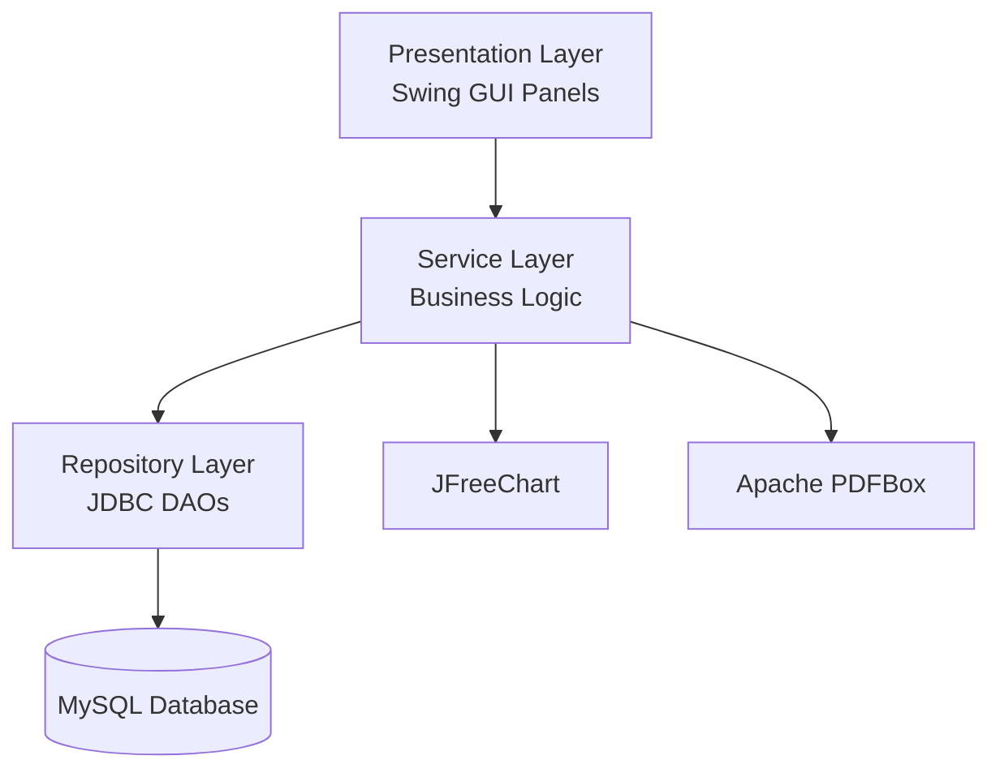

# Design Document: Online Quiz and Examination Management System

## Overview

A Java desktop application (Swing GUI) backed by MySQL. Three roles — Administrator, Professor, Student — interact through role-specific screens. The system uses a strict 3-layer architecture: Presentation (Swing), Service (business logic), Repository (JDBC DAOs). JFreeChart handles graphs; Apache PDFBox handles PDF export; jBCrypt handles password hashing; HikariCP manages the connection pool.

---

## Architecture



---

## Backend Package Structure

```
com.quizexam
├── Main.java                        # Entry point; DB connectivity check; launches UI
├── config/
│   └── DatabaseConfig.java          # HikariCP DataSource setup from db.properties
├── exception/
│   ├── AppException.java            # Base checked exception
│   ├── AuthException.java
│   ├── DuplicateUserException.java
│   ├── UnauthorizedException.java
│   ├── ValidationException.java
│   ├── QuestionInUseException.java
│   ├── ExamHasAttemptsException.java
│   ├── AlreadyAttemptedException.java
│   ├── ExamNotAvailableException.java
│   └── DatabaseException.java       # Wraps SQLException
├── model/
│   ├── User.java
│   ├── Role.java                    # Enum: ADMIN, PROFESSOR, STUDENT
│   ├── Session.java
│   ├── Question.java                # Abstract base
│   ├── MCQ.java
│   ├── MCQOption.java
│   ├── AssertionReasonQuestion.java
│   ├── ARChoice.java                # Enum: 5 choices
│   ├── TrueFalseQuestion.java
│   ├── Difficulty.java              # Enum: EASY, MEDIUM, HARD
│   ├── Exam.java
│   ├── ExamQuestion.java
│   ├── Attempt.java
│   ├── AttemptAnswer.java
│   ├── Result.java
│   ├── Notification.java
│   └── ExamStats.java
├── repository/
│   ├── UserRepository.java          # Interface
│   ├── QuestionRepository.java      # Interface
│   ├── ExamRepository.java          # Interface
│   ├── AttemptRepository.java       # Interface
│   ├── ResultRepository.java        # Interface
│   ├── NotificationRepository.java  # Interface
│   └── impl/
│       ├── UserRepositoryImpl.java
│       ├── QuestionRepositoryImpl.java
│       ├── ExamRepositoryImpl.java
│       ├── AttemptRepositoryImpl.java
│       ├── ResultRepositoryImpl.java
│       └── NotificationRepositoryImpl.java
├── service/
│   ├── AuthService.java             # Interface
│   ├── QuestionService.java         # Interface
│   ├── ExamService.java             # Interface
│   ├── AttemptService.java          # Interface
│   ├── ScoringService.java          # Interface
│   ├── ResultService.java           # Interface
│   ├── AnalyticsService.java        # Interface
│   ├── NotificationService.java     # Interface
│   ├── AdaptiveExamService.java     # Interface
│   └── impl/
│       ├── AuthServiceImpl.java
│       ├── QuestionServiceImpl.java
│       ├── ExamServiceImpl.java
│       ├── AttemptServiceImpl.java
│       ├── ScoringServiceImpl.java
│       ├── ResultServiceImpl.java
│       ├── AnalyticsServiceImpl.java
│       ├── NotificationServiceImpl.java
│       └── AdaptiveExamServiceImpl.java
└── ui/
    ├── LoginPanel.java
    ├── RegisterPanel.java
    ├── admin/
    ├── professor/
    └── student/
```

---

## Service Interfaces

### AuthService
```java
interface AuthService {
    User register(String username, String email, String password, Role role)
        throws ValidationException, DuplicateUserException;
    Session login(String username, String password) throws AuthException;
    void logout(Session session);
    User createAdmin(Session adminSession, String username, String email, String password)
        throws UnauthorizedException, DuplicateUserException;
}
```

### QuestionService
```java
interface QuestionService {
    MCQ createMCQ(Session s, String text, List<String> options, int correctIndex,
                  Difficulty difficulty, String subject, String topic);
    AssertionReasonQuestion createAssertionReason(Session s, String assertion, String reason,
        ARChoice correct, Difficulty difficulty, String subject, String topic);
    TrueFalseQuestion createTrueFalse(Session s, String text, boolean correctAnswer,
        Difficulty difficulty, String subject, String topic);
    Question updateQuestion(Session s, long questionId, QuestionUpdateRequest req)
        throws QuestionInUseException;
    void deleteQuestion(Session s, long questionId) throws QuestionInUseException;
    List<Question> searchQuestions(Session s, QuestionFilter filter);
}
```

### ExamService
```java
interface ExamService {
    Exam createExam(Session s, ExamCreateRequest req);
    Exam publishExam(Session s, long examId);
    Exam updateExam(Session s, long examId, ExamUpdateRequest req)
        throws ExamHasAttemptsException;
    void deleteExam(Session s, long examId) throws ExamHasAttemptsException;
    List<Exam> listAvailableExams(Session s);
}
```

### AttemptService
```java
interface AttemptService {
    Attempt startAttempt(Session s, long examId)
        throws AlreadyAttemptedException, ExamNotAvailableException;
    void recordAnswer(Session s, long attemptId, long questionId, String answer);
    Result submitAttempt(Session s, long attemptId);
    Result autoSubmit(long attemptId);
    void logTabSwitch(long attemptId);
}
```

### ScoringService
```java
interface ScoringService {
    // Pure function — no DB access; called by AttemptService after finalization
    Result score(Attempt attempt, Exam exam, List<Question> questions,
                 List<AttemptAnswer> answers);
}
```

### ResultService
```java
interface ResultService {
    Result getResultForStudent(Session s, long examId);
    List<Result> getResultsForExam(Session s, long examId);
    void exportResultsCSV(Session s, long examId, Path outputPath);
    void exportResultsPDF(Session s, long examId, Path outputPath);
}
```

### AnalyticsService
```java
interface AnalyticsService {
    ExamStats getExamStats(Session s, long examId);
    List<QuestionStats> getHardestQuestions(Session s, long examId);
    JFreeChart buildScoreBarChart(Session s, long examId);
    JFreeChart buildScoreDistributionPieChart(Session s, long examId);
    JFreeChart buildStudentProgressLineChart(Session s, long studentId);
}
```

### AdaptiveExamService
```java
interface AdaptiveExamService {
    Question selectNextQuestion(long attemptId, long lastQuestionId, boolean wasCorrect,
                                List<Question> questionPool);
}
```

---

## Database Schema (MySQL DDL)

```sql
CREATE TABLE users (
    id            BIGINT AUTO_INCREMENT PRIMARY KEY,
    username      VARCHAR(50)  NOT NULL UNIQUE,
    email         VARCHAR(100) NOT NULL UNIQUE,
    password_hash VARCHAR(255) NOT NULL,
    role          ENUM('ADMIN','PROFESSOR','STUDENT') NOT NULL,
    created_at    TIMESTAMP DEFAULT CURRENT_TIMESTAMP
);

CREATE TABLE questions (
    id          BIGINT AUTO_INCREMENT PRIMARY KEY,
    type        ENUM('MCQ','AR','TF') NOT NULL,
    text        TEXT NOT NULL,
    difficulty  ENUM('EASY','MEDIUM','HARD'),
    subject     VARCHAR(100),
    topic       VARCHAR(100),
    created_by  BIGINT NOT NULL REFERENCES users(id),
    created_at  TIMESTAMP DEFAULT CURRENT_TIMESTAMP
);

CREATE TABLE mcq_options (
    id           BIGINT AUTO_INCREMENT PRIMARY KEY,
    question_id  BIGINT NOT NULL REFERENCES questions(id) ON DELETE CASCADE,
    option_index TINYINT NOT NULL,          -- 0 to 3
    option_text  TEXT NOT NULL,
    is_correct   BOOLEAN NOT NULL DEFAULT FALSE
);

CREATE TABLE ar_details (
    question_id    BIGINT PRIMARY KEY REFERENCES questions(id) ON DELETE CASCADE,
    assertion      TEXT NOT NULL,
    reason         TEXT NOT NULL,
    correct_choice TINYINT NOT NULL         -- 1 to 5
);

CREATE TABLE tf_details (
    question_id    BIGINT PRIMARY KEY REFERENCES questions(id) ON DELETE CASCADE,
    correct_answer BOOLEAN NOT NULL
);

CREATE TABLE exams (
    id                  BIGINT AUTO_INCREMENT PRIMARY KEY,
    title               VARCHAR(200) NOT NULL,
    description         TEXT,
    time_limit_minutes  INT NOT NULL CHECK (time_limit_minutes >= 1),
    marks_per_question  INT NOT NULL,
    negative_marking    DECIMAL(5,2) DEFAULT 0.00,
    is_adaptive         BOOLEAN DEFAULT FALSE,
    status              ENUM('DRAFT','ACTIVE') DEFAULT 'DRAFT',
    start_datetime      DATETIME,
    end_datetime        DATETIME,
    created_by          BIGINT NOT NULL REFERENCES users(id),
    created_at          TIMESTAMP DEFAULT CURRENT_TIMESTAMP
);

CREATE TABLE exam_questions (
    exam_id       BIGINT NOT NULL REFERENCES exams(id) ON DELETE CASCADE,
    question_id   BIGINT NOT NULL REFERENCES questions(id),
    display_order INT NOT NULL,
    PRIMARY KEY (exam_id, question_id)
);

CREATE TABLE attempts (
    id              BIGINT AUTO_INCREMENT PRIMARY KEY,
    exam_id         BIGINT NOT NULL REFERENCES exams(id),
    student_id      BIGINT NOT NULL REFERENCES users(id),
    started_at      TIMESTAMP NOT NULL,
    submitted_at    TIMESTAMP,
    status          ENUM('IN_PROGRESS','SUBMITTED') DEFAULT 'IN_PROGRESS',
    tab_switch_count INT DEFAULT 0,
    UNIQUE (exam_id, student_id)
);

CREATE TABLE attempt_answers (
    attempt_id    BIGINT NOT NULL REFERENCES attempts(id) ON DELETE CASCADE,
    question_id   BIGINT NOT NULL REFERENCES questions(id),
    answer_value  VARCHAR(255),
    display_order INT NOT NULL,
    PRIMARY KEY (attempt_id, question_id)
);

CREATE TABLE results (
    id           BIGINT AUTO_INCREMENT PRIMARY KEY,
    attempt_id   BIGINT NOT NULL UNIQUE REFERENCES attempts(id),
    total_score  DECIMAL(8,2) NOT NULL,
    max_score    INT NOT NULL,
    percentage   DECIMAL(5,2) NOT NULL,
    detail_json  TEXT NOT NULL
);

CREATE TABLE notifications (
    id         BIGINT AUTO_INCREMENT PRIMARY KEY,
    user_id    BIGINT NOT NULL REFERENCES users(id),
    message    TEXT NOT NULL,
    exam_id    BIGINT REFERENCES exams(id),
    created_at TIMESTAMP DEFAULT CURRENT_TIMESTAMP,
    is_read    BOOLEAN DEFAULT FALSE
);
```

---

## Key Backend Flows

### Registration & Login
```
register(username, email, password, role)
  → validate fields (non-empty, email format, password length ≥ 8)
  → check username/email uniqueness in DB
  → hash password with BCrypt (cost factor 12)
  → INSERT into users within transaction
  → return User

login(username, password)
  → SELECT user by username
  → BCrypt.checkpw(password, stored_hash)
  → if match: create Session(userId, role, token=UUID)
  → if no match: throw AuthException
```

### Exam Attempt Lifecycle
```
startAttempt(session, examId)
  → check exam status = ACTIVE
  → check current datetime within [start_datetime, end_datetime]
  → check no existing SUBMITTED attempt for (student, exam)
  → INSERT attempt (status=IN_PROGRESS, started_at=now())
  → shuffle question order, INSERT attempt_answers rows (answer_value=null)
  → schedule autoSubmit after time_limit_minutes via ScheduledExecutorService
  → return Attempt

recordAnswer(session, attemptId, questionId, answer)
  → verify attempt belongs to session's student and status=IN_PROGRESS
  → UPDATE attempt_answers SET answer_value=? WHERE attempt_id=? AND question_id=?

submitAttempt(session, attemptId) / autoSubmit(attemptId)
  → UPDATE attempts SET status=SUBMITTED, submitted_at=now()
  → load all attempt_answers
  → call ScoringService.score(attempt, exam, questions, answers)
  → INSERT result within transaction
  → cancel scheduled autoSubmit if manual submission
  → return Result
```

### Scoring Algorithm
```
ScoringServiceImpl.score(attempt, exam, questions, answers):
  correctCount = 0
  incorrectCount = 0
  for each question in questions:
    recorded = answers.get(questionId)  // null if unanswered
    if recorded == null:
      incorrectCount++   // unanswered = incorrect, 0 marks
    else if recorded == correctAnswer(question):
      correctCount++
    else:
      incorrectCount++
  totalScore = (correctCount * exam.marksPerQuestion)
             - (incorrectCount * exam.negativeMarking)
  maxScore = questions.size() * exam.marksPerQuestion
  percentage = (totalScore / maxScore) * 100
  detailJson = buildDetailJson(questions, answers)
  return new Result(totalScore, maxScore, percentage, detailJson)
```

### Adaptive Question Selection
```
AdaptiveExamServiceImpl.selectNextQuestion(attemptId, lastQuestionId, wasCorrect, pool):
  currentDifficulty = pool.find(lastQuestionId).difficulty
  if wasCorrect:
    candidates = pool.filter(d >= currentDifficulty AND not yet answered)
  else:
    candidates = pool.filter(d <= currentDifficulty AND not yet answered)
  if candidates.empty:
    candidates = pool.filter(not yet answered)  // fallback
  return candidates.pickRandom()
```

### Transaction Pattern (all write operations)
```java
Connection conn = dataSource.getConnection();
conn.setAutoCommit(false);
try {
    // ... execute statements ...
    conn.commit();
} catch (SQLException e) {
    conn.rollback();
    throw new DatabaseException("Operation failed", e);
} finally {
    conn.setAutoCommit(true);
    conn.close();
}
```

---

## Data Models

### Entity: User
| Column | Type | Notes |
|---|---|---|
| id | BIGINT PK | auto-increment |
| username | VARCHAR(50) UNIQUE | |
| email | VARCHAR(100) UNIQUE | |
| password_hash | VARCHAR(255) | BCrypt cost 12 |
| role | ENUM('ADMIN','PROFESSOR','STUDENT') | |
| created_at | TIMESTAMP | |

### Entity: Question (base)
| Column | Type | Notes |
|---|---|---|
| id | BIGINT PK | |
| type | ENUM('MCQ','AR','TF') | discriminator |
| text | TEXT | |
| difficulty | ENUM('EASY','MEDIUM','HARD') | nullable |
| subject | VARCHAR(100) | nullable |
| topic | VARCHAR(100) | nullable |
| created_by | BIGINT FK → User | |

### Entity: Exam
| Column | Type | Notes |
|---|---|---|
| id | BIGINT PK | |
| title | VARCHAR(200) | |
| time_limit_minutes | INT | ≥ 1 |
| marks_per_question | INT | |
| negative_marking | DECIMAL(5,2) | 0 if not used |
| is_adaptive | BOOLEAN | |
| status | ENUM('DRAFT','ACTIVE') | |
| start_datetime | DATETIME | nullable |
| end_datetime | DATETIME | nullable |

### Entity: Attempt
| Column | Type | Notes |
|---|---|---|
| id | BIGINT PK | |
| exam_id + student_id | UNIQUE | prevents re-attempt |
| status | ENUM('IN_PROGRESS','SUBMITTED') | |
| tab_switch_count | INT | |

### Entity: Result
| Column | Type | Notes |
|---|---|---|
| attempt_id | BIGINT UNIQUE FK | |
| total_score | DECIMAL(8,2) | supports negative values |
| max_score | INT | |
| percentage | DECIMAL(5,2) | |
| detail_json | TEXT | per-question breakdown |

---

## Correctness Properties

*A property is a characteristic or behavior that should hold true across all valid executions of a system — essentially, a formal statement about what the system should do. Properties serve as the bridge between human-readable specifications and machine-verifiable correctness guarantees.*

### Property 1: Password hashing non-reversible and verifiable
*For any* plaintext password, `hash != plaintext` AND `BCrypt.checkpw(plaintext, hash) == true`.
**Validates: Requirements 1.3**

### Property 2: Login rejects wrong credentials
*For any* registered user, supplying an incorrect password must throw `AuthException` and must not create a Session.
**Validates: Requirements 1.5**

### Property 3: MCQ correct-option invariant
*For any* MCQ stored in the database, exactly one of its four options must have `is_correct = true`.
**Validates: Requirements 2.1**

### Property 4: Assertion-Reason choice range invariant
*For any* AR question, `correct_choice` must be in [1, 5].
**Validates: Requirements 2.2**

### Property 5: Question search filter correctness
*For any* `QuestionFilter`, all questions returned by `searchQuestions` must satisfy every non-null filter criterion (type, difficulty, subject, topic, keyword).
**Validates: Requirements 2.9**

### Property 6: Exam time limit invariant
*For any* Exam stored in the database, `time_limit_minutes >= 1`.
**Validates: Requirements 3.1**

### Property 7: Exam edit/delete blocked when attempts exist
*For any* Exam with at least one SUBMITTED Attempt, `updateExam` and `deleteExam` must throw `ExamHasAttemptsException`.
**Validates: Requirements 3.6, 3.7**

### Property 8: Attempt blocked outside scheduling window
*For any* Exam with a defined window, `startAttempt` before `start_datetime` or after `end_datetime` must throw `ExamNotAvailableException`.
**Validates: Requirements 4.2**

### Property 9: Answer overwrite idempotence
*For any* in-progress Attempt, calling `recordAnswer` for the same question multiple times must result in only the most recent answer being stored.
**Validates: Requirements 5.4, 5.5**

### Property 10: Score computation correctness
*For any* finalized Attempt, `total_score = (correct_count × marks_per_question) − (incorrect_count × negative_marking)` and `percentage = (total_score / max_score) × 100`. Unanswered questions count as incorrect.
**Validates: Requirements 7.1, 7.2, 7.3, 7.4**

### Property 11: Auto-submit and manual-submit produce identical scoring
*For any* Attempt state, `autoSubmit` and `submitAttempt` on the same answer state must produce a Result with the same `total_score` and `percentage`.
**Validates: Requirements 5.6, 5.7**

### Property 12: Re-attempt is blocked
*For any* Student with a SUBMITTED Attempt for an Exam, `startAttempt` for the same Exam must throw `AlreadyAttemptedException`.
**Validates: Requirements 5.8**

### Property 13: Question deletion blocked in active exam
*For any* Question referenced by at least one ACTIVE Exam, `deleteQuestion` must throw `QuestionInUseException`.
**Validates: Requirements 2.8**

### Property 14: Result persistence round-trip
*For any* finalized Attempt, saving a Result and retrieving it by `attempt_id` must produce an equivalent Result (same score, percentage, detail_json).
**Validates: Requirements 7.5**

### Property 15: CSV export row count matches attempt count
*For any* Exam with N submitted Attempts, the exported CSV must contain exactly N data rows (excluding header).
**Validates: Requirements 10.3**

### Property 16: Exam stats arithmetic correctness
*For any* Exam with N Results, `getExamStats` must return average = arithmetic mean of all `total_score` values, and highest/lowest must match max/min.
**Validates: Requirements 11.1**

### Property 17: Adaptive difficulty progression
*For any* adaptive Exam Attempt, after a correct answer the next question's difficulty must be ≥ current; after an incorrect answer it must be ≤ current.
**Validates: Requirements 13.2, 13.3**

### Property 18: Transaction rollback on failure
*For any* write operation that throws a `SQLException` mid-transaction, the database state must be identical to its state before the operation began.
**Validates: Requirements 12.4, 12.5**

---

## Error Handling

| Scenario | Exception | Response |
|---|---|---|
| Duplicate username/email | `DuplicateUserException` | "Username or email already in use" |
| Wrong credentials | `AuthException` | "Invalid credentials" |
| Unauthorized role action | `UnauthorizedException` | "Access denied" |
| Delete question in active exam | `QuestionInUseException` | "Question is used in an active exam" |
| Edit/delete exam with attempts | `ExamHasAttemptsException` | "Exam has submitted attempts and cannot be modified" |
| Re-attempt completed exam | `AlreadyAttemptedException` | "You have already completed this exam" |
| Attempt outside window | `ExamNotAvailableException` | "This exam is not currently available" |
| DB transaction failure | `DatabaseException` | "A database error occurred; please try again" + log |
| DB connection failure at startup | — | Log + `System.exit(1)` |
| Validation failure | `ValidationException` | Field-specific message |

---

## Testing Strategy

### Unit Testing (JUnit 5 + Mockito)
- Test each Service `impl` class in isolation with mocked Repository dependencies.
- Focus on: validation, scoring (with/without negative marking), role enforcement, exception paths.
- Examples: all-correct attempt, all-unanswered attempt, adaptive step-up/step-down.

### Property-Based Testing (jqwik)
- All 18 correctness properties implemented as jqwik property tests.
- Minimum 100 iterations per test.
- Tag: `@Label("Feature: online-quiz-exam-system, Property N: <text>")`

| Property | Test class |
|---|---|
| 1–2 | `AuthServicePropertyTest` |
| 3–5, 13 | `QuestionServicePropertyTest` |
| 6–7 | `ExamServicePropertyTest` |
| 8–9, 11–12 | `AttemptServicePropertyTest` |
| 10 | `ScoringServicePropertyTest` |
| 14 | `ResultRepositoryPropertyTest` |
| 15–16 | `ResultServicePropertyTest` / `AnalyticsServicePropertyTest` |
| 17 | `AdaptiveExamServicePropertyTest` |
| 18 | `TransactionPropertyTest` |

### Integration Testing (H2 in-memory, MySQL-compatible mode)
- Full attempt lifecycle: start → answer → submit → result
- Admin/professor exam lifecycle: create → publish → delete guard
- Scheduling window enforcement
- Transaction rollback simulation

### Test balance
- Property tests cover universal correctness; unit tests cover specific examples and edge cases. Both required.
